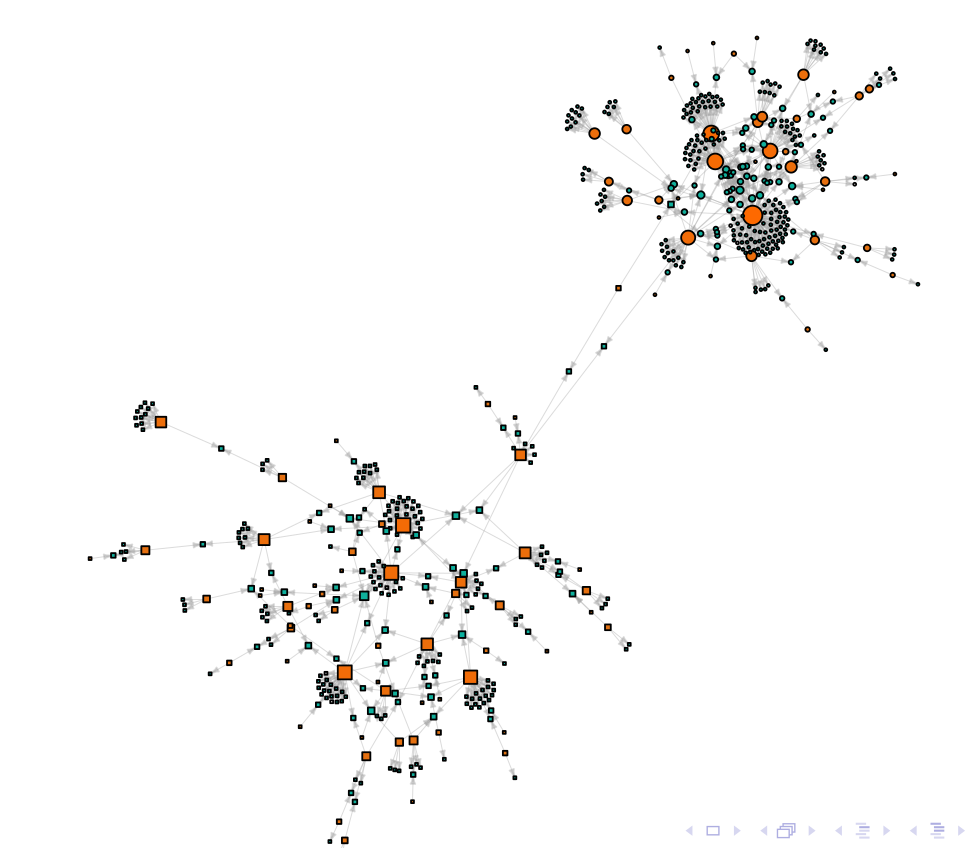

# Influence Networks
This repository contains the source code for the paper Influence Networks: Bayesian Modelling and Diffusion.

The network used in the Case of study (Section 4) is in [`datasets/hoaxy/reforma_tributaria_04_11_2022_5pm_mixed_spanish.csv`](datasets/hoaxy/reforma_tributaria_04_11_2022_5pm_mixed_spanish.csv) and it is loaded and plotted on [`reading_data.R`](reading_data.R). Furthermore, the projection's based model is fitted on [`jags_implementation.R`](jags_implementation.R) using `Jags`. The results are also plotted on the same script. The power of the model to estimate the true parameters of a network (Section 4.3) is tested on [`simulations_for_influence_model.R`](simulations_for_influence_model.R).

The Simulations for the diffusion model (Section 5) are performed on the script [`simulate_from_influence_model.R`](simulate_from_influence_model.R). However, the cascade simulation which is described on Appendix B is implemented in `C++` on [`cascade.cpp`](cascade.cpp) and is connected with R through Rcpp package. Additionally [`optimize.cpp`](optimize.cpp) contains the function that uses the Newton method to find $k^*$ for each simulation scenario.

The script [`aditional_inference_results.R`](aditional_inference_results.R) contains several graphics that depend on the previous scripts.

Please note that the scripts must be excecuted in the order that are presented here, otherwise they wont work. This is because each one generates `.RData` objects that are used by the following.

The following packages are needed: `car`, `cluster`, `coda`, `dplyr`, `fda`, `fields`, `igraph`, `paletteer`, `R2jags`, `Rcpp`, `RcppArmadillo`, `scales`, `tseries` and `xtable`.
